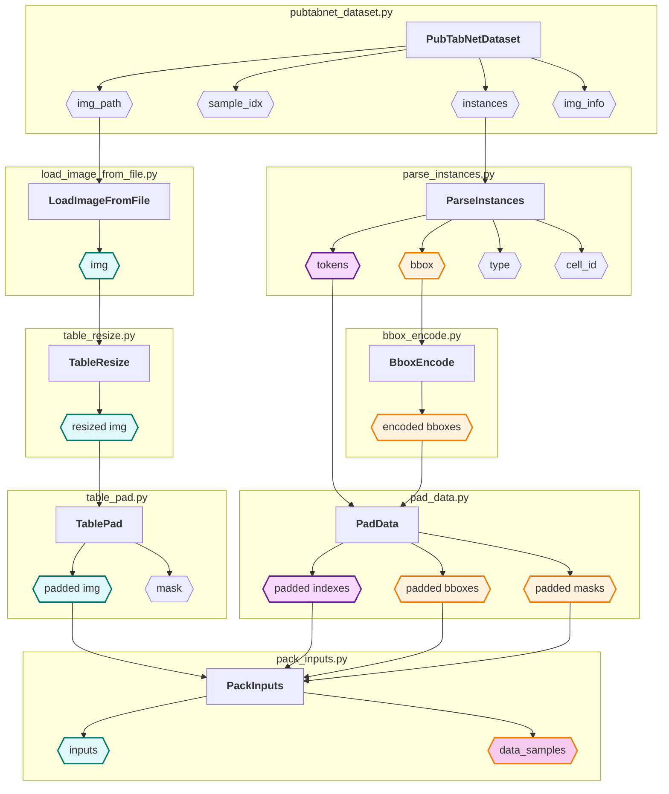

### 1.2 Pipeline xử lý dữ liệu
#### Sơ đồ Pipeline (gom output cạnh node xử lý)

```mermaid
flowchart TD
    %% Dataset node
    subgraph pubtabnet_dataset.py
        PubTabNetDataset["<b>PubTabNetDataset</b>"]
        PubTabNetDataset.img_path{{"img_path"}}
        PubTabNetDataset.sample_idx{{"sample_idx"}}
        PubTabNetDataset.instances{{"instances"}}
        PubTabNetDataset.img_info{{"img_info"}}
        PubTabNetDataset --> PubTabNetDataset.img_path
        PubTabNetDataset --> PubTabNetDataset.sample_idx
        PubTabNetDataset --> PubTabNetDataset.instances
        PubTabNetDataset --> PubTabNetDataset.img_info
    end
    %% LoadImageFromFile
    subgraph load_image_from_file.py
        LoadImageFromFile["<b>LoadImageFromFile</b>"]
        LoadImageFromFile.img{{img}}
        LoadImageFromFile --> LoadImageFromFile.img
    end
    %% ParseInstances
    subgraph parse_instances.py
        ParseInstances["<b>ParseInstances</b>"]
        ParseInstances.tokens{{tokens}}
        ParseInstances.bbox{{bbox}}
        ParseInstances.type{{type}}
        ParseInstances.cell_id{{cell_id}}
        ParseInstances --> ParseInstances.tokens
        ParseInstances --> ParseInstances.bbox
        ParseInstances --> ParseInstances.type
        ParseInstances --> ParseInstances.cell_id
    end
    %% TableResize
    subgraph table_resize.py
        TableResize["<b>TableResize</b>"]
        TableResize.resized_img{{resized img}}
        TableResize --> TableResize.resized_img
    end
    %% TablePad
    subgraph table_pad.py
        TablePad["<b>TablePad</b>"]
        TablePad.padded_img{{padded img}}
        TablePad.mask{{mask}}
        TablePad --> TablePad.padded_img
        TablePad --> TablePad.mask
    end
    %% BboxEncode
    subgraph bbox_encode.py
        BboxEncode["<b>BboxEncode</b>"]
        BboxEncode.encoded_bboxes{{encoded bboxes}}
        BboxEncode --> BboxEncode.encoded_bboxes
    end
    %% PadData
    subgraph pad_data.py
        PadData["<b>PadData</b>"]
        PadData.padded_indexes{{padded indexes}}
        PadData.padded_bboxes{{padded bboxes}}
        PadData.padded_masks{{padded masks}}
        PadData --> PadData.padded_indexes
        PadData --> PadData.padded_bboxes
        PadData --> PadData.padded_masks
    end
    %% PackInputs
    subgraph pack_inputs.py
        PackInputs["<b>PackInputs</b>"]
        PackInputs.inputs{{inputs}}
        PackInputs.data_samples{{data_samples}}
        PackInputs --> PackInputs.inputs
        PackInputs --> PackInputs.data_samples
    end
    %% Kết nối các bước
    PubTabNetDataset.img_path --> LoadImageFromFile
    PubTabNetDataset.instances --> ParseInstances
    LoadImageFromFile.img --> TableResize
    TableResize.resized_img --> TablePad
    TablePad.padded_img --> PackInputs
    %% Bỏ đường nối TablePad.mask --> PadData (mask không dùng để tạo padded_masks)
    ParseInstances.tokens --> PadData
    ParseInstances.bbox --> BboxEncode
    BboxEncode.encoded_bboxes --> PadData
    PadData.padded_indexes --> PackInputs
    PadData.padded_bboxes --> PackInputs
    PadData.padded_masks --> PackInputs
    %% Style cho output
    %% Nhóm ảnh: img -> resized img -> padded img
    style LoadImageFromFile.img fill:#e0f7fa,stroke:#00796b,stroke-width:2px
    style TableResize.resized_img fill:#e0f7fa,stroke:#00796b,stroke-width:2px
    style TablePad.padded_img fill:#e0f7fa,stroke:#00796b,stroke-width:2px
    style PackInputs.inputs fill:#e0f7fa,stroke:#00796b,stroke-width:2px
    %% Nhóm tokens: tokens -> padded indexes
    style ParseInstances.tokens fill:#F6D8FCFF,stroke:#6a1b9a,stroke-width:2px
    style PadData.padded_indexes fill:#F6D8FCFF,stroke:#6a1b9a,stroke-width:2px
    %% Nhóm bboxes: bbox -> encoded bboxes -> padded bboxes
    style ParseInstances.bbox fill:#fff3e0,stroke:#f57c00,stroke-width:2px
    style BboxEncode.encoded_bboxes fill:#fff3e0,stroke:#f57c00,stroke-width:2px
    style PadData.padded_bboxes fill:#fff3e0,stroke:#f57c00,stroke-width:2px
    style PadData.padded_masks fill:#fff3e0,stroke:#f57c00,stroke-width:2px 
    style PackInputs.data_samples fill:#F7CBEEFF,stroke:#f57c00,stroke-width:2px  
```