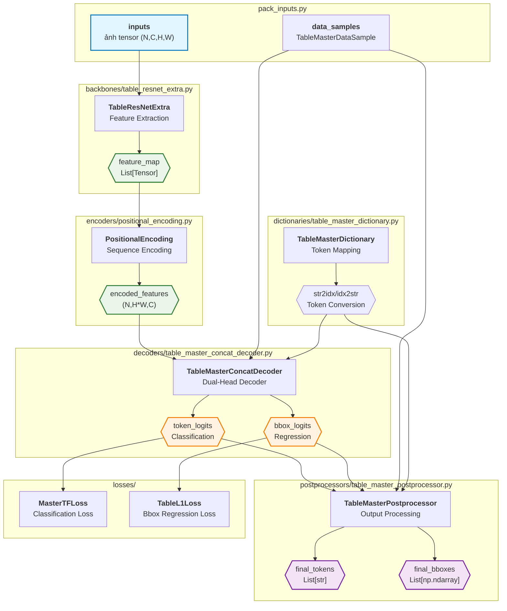

# Model Overview

## 2.1 Kiến trúc TableMaster

### Tổng quan
TableMaster là một end-to-end model cho table structure recognition, sử dụng dual-head architecture để predict cả table structure tokens và bounding box coordinates. Model được thiết kế để xử lý images của bảng và tạo ra structured output bao gồm HTML-like tokens và spatial information.

### Thành phần chính

#### Sơ đồ Model Architecture

### Component Details

#### 1. Backbone (TableResNetExtra)
- **Chức năng:** Trích xuất multi-scale features từ table images
- **Input:** Table images (N, C, H, W)
- **Output:** Multi-scale feature maps
- **Đặc điểm:** ResNet-based với Global Context Blocks

#### 2. Encoder (PositionalEncoding)
- **Chức năng:** Thêm positional information vào spatial features
- **Input:** 2D feature maps
- **Output:** 1D sequence với positional encoding
- **Đặc điểm:** Sinusoidal positional encoding

#### 3. Decoder (TableMasterConcatDecoder)
- **Chức năng:** Dual-head prediction cho tokens và bboxes
- **Input:** Encoded features + target sequences
- **Output:** Classification logits + bbox coordinates
- **Đặc điểm:** Transformer-based với concatenation strategy

#### 4. Dictionary (TableMasterDictionary)
- **Chức năng:** Token mapping cho table structure elements
- **Features:** Multi-character tokens, special tokens
- **Tokens:** `<table>`, `<tr>`, `<td>`, `<eb></eb>`, etc.

#### 5. Postprocessor (TableMasterPostprocessor)
- **Chức năng:** Convert raw outputs thành meaningful predictions
- **Input:** Logits + bbox coordinates
- **Output:** Token strings + denormalized bboxes
- **Đặc điểm:** Confidence thresholding, coordinate denormalization

### Training Process

1. **Data Flow:**
   - Images → Backbone → Encoder → Decoder
   - Ground truth tokens/bboxes → Loss calculation

2. **Loss Functions:**
   - **MasterTFLoss:** Cross-entropy cho token classification
   - **TableL1Loss:** L1 loss cho bbox regression

3. **Optimization:**
   - Multi-task learning với token + bbox objectives
   - Gradient balancing giữa classification và regression

### Inference Process

1. **Forward Pass:**
   - Image → Features → Encoded features → Predictions

2. **Postprocessing:**
   - Logits → Token strings
   - Bbox coordinates → Denormalized bounding boxes

3. **Output:**
   - Structured table representation
   - Spatial information for cells

### Quan hệ với Dataset Pipeline

Model nhận input từ dataset pipeline:
- [Pack Inputs](../../datasets/transforms/pack_inputs/README.md)
- TableMasterDataSample format
- Normalized images và ground truth labels

### Evaluation

Model được evaluate bằng:
- [Metrics](metrics/README.md)
- TEDS (Tree Edit Distance based Similarity)
- Token accuracy, bbox IoU, structure consistency

### Lưu ý đặc biệt

- **Dual-head architecture** essential cho table recognition
- **Multi-scale features** important cho spatial understanding
- **Attention mechanism** captures table structure relationships
- **Postprocessing** critical cho meaningful outputs
- **Dictionary design** affects model vocabulary và performance
