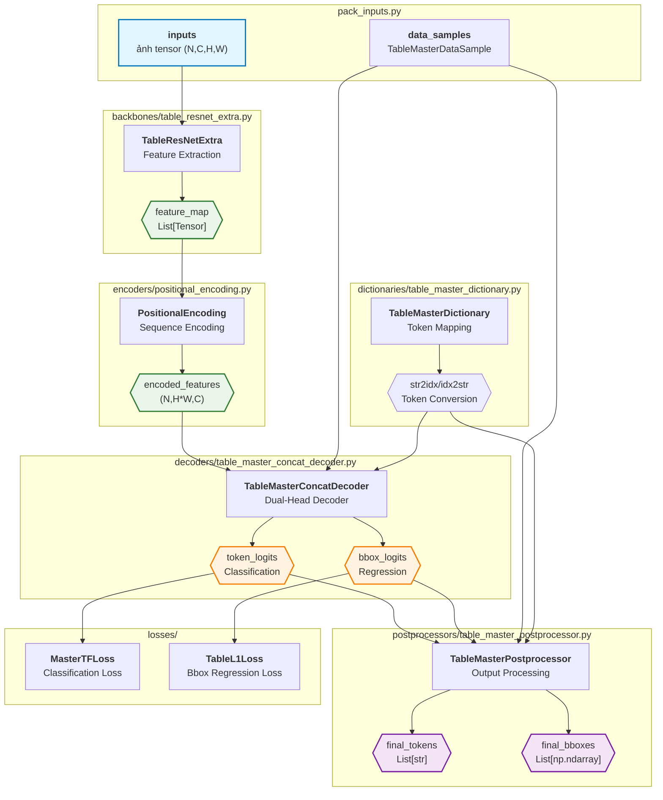

# Model Overview

## 2.1 Kiến trúc TableMaster

### Tổng quan
TableMaster là một end-to-end model cho table structure recognition, sử dụng dual-head architecture để predict cả table structure tokens và bounding box coordinates. Model được thiết kế để xử lý images của bảng và tạo ra structured output bao gồm HTML-like tokens và spatial information.

### Thành phần chính

#### Sơ đồ Model Architecture

### Chi tiết các thành phần

#### 1. Backbone (TableResNetExtra)
- **Chức năng:** Trích xuất đặc trưng đa tỷ lệ từ ảnh bảng
- **Input:** Ảnh bảng (N, C, H, W)
- **Output:** Feature maps đa tỷ lệ
- **Đặc điểm:** Dựa trên ResNet, tích hợp Global Context Blocks

#### 2. Encoder (PositionalEncoding)
- **Chức năng:** Thêm thông tin vị trí vào đặc trưng không gian
- **Input:** Feature maps 2D
- **Output:** Chuỗi 1D với positional encoding
- **Đặc điểm:** Sinusoidal positional encoding

#### 3. Decoder (TableMasterConcatDecoder)
- **Chức năng:** Dự đoán hai đầu cho tokens và bboxes
- **Input:** Đặc trưng đã mã hóa + chuỗi mục tiêu
- **Output:** Logits phân loại + tọa độ bbox
- **Đặc điểm:** Dựa trên Transformer với chiến lược nối đặc trưng

#### 4. Dictionary (TableMasterDictionary)
- **Chức năng:** Ánh xạ token cho các phần tử cấu trúc bảng
- **Đặc điểm:** Token nhiều ký tự, special tokens
- **Tokens:** `<table>`, `<tr>`, `<td>`, `<eb></eb>`, v.v.

#### 5. Postprocessor (TableMasterPostprocessor)
- **Chức năng:** Chuyển đổi output thô thành dự đoán có ý nghĩa
- **Input:** Logits + tọa độ bbox
- **Output:** Chuỗi token + bbox đã khử chuẩn hóa
- **Đặc điểm:** Ngưỡng độ tin cậy, khử chuẩn hóa tọa độ

### Quy trình huấn luyện

1. **Luồng dữ liệu:**
   - Ảnh → Backbone → Encoder → Decoder
   - Ground truth tokens/bboxes → Tính loss

2. **Hàm loss:**
   - **MasterTFLoss:** Cross-entropy cho phân loại token
   - **TableL1Loss:** L1 loss cho hồi quy bbox

3. **Tối ưu hóa:**
   - Học đa nhiệm với mục tiêu token + bbox
   - Cân bằng gradient giữa phân loại và hồi quy

### Quy trình suy luận

1. **Forward Pass:**
   - Ảnh → Đặc trưng → Đặc trưng đã mã hóa → Dự đoán

2. **Hậu xử lý:**
   - Logits → Chuỗi token
   - Tọa độ bbox → Bbox đã khử chuẩn hóa

3. **Output:**
   - Biểu diễn bảng có cấu trúc
   - Thông tin không gian cho các ô

### Quan hệ với Dataset Pipeline

Model nhận input từ pipeline dữ liệu:
- [Pack Inputs](../../datasets/transforms/pack_inputs/README.md)
- Định dạng TableMasterDataSample
- Ảnh đã chuẩn hóa và ground truth labels

### Đánh giá

Model được đánh giá bằng:
- [Metrics](metrics/README.md)
- TEDS (Tree Edit Distance based Similarity)
- Độ chính xác token, bbox IoU, tính nhất quán cấu trúc

### Lưu ý đặc biệt

- **Kiến trúc dual-head** rất quan trọng cho nhận diện bảng
- **Đặc trưng đa tỷ lệ** quan trọng cho hiểu không gian
- **Attention mechanism** giúp mô hình hóa quan hệ cấu trúc bảng
- **Hậu xử lý** quyết định output có ý nghĩa
- **Thiết kế dictionary** ảnh hưởng đến từ vựng và hiệu năng mô hình
