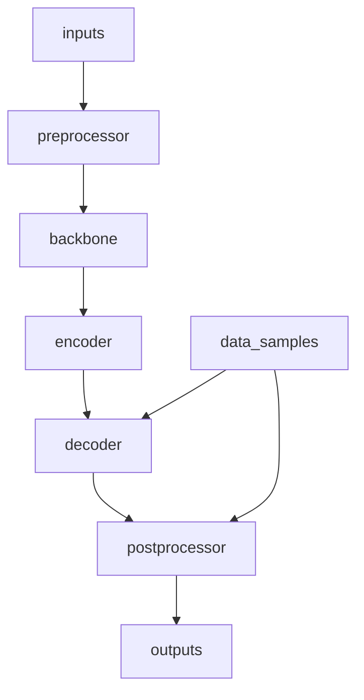

# Recognizer

## 6. TableMaster

**Chức năng:** Lớp nhận diện chính cho nhận diện cấu trúc bảng. Tích hợp tất cả các thành phần (backbone, encoder, decoder) thành một mô hình hoàn chỉnh với kiến trúc hai đầu (dual-head).

**Đặc điểm:**
- Tích hợp backbone, encoder, decoder thành mô hình end-to-end
- Kiến trúc hai đầu cho nhận diện cấu trúc và hồi quy bbox
- Hỗ trợ cả chế độ huấn luyện và suy luận
- Cấu hình thành phần linh hoạt
- Tương thích với framework mmOCR

**Input:**
- `inputs`: Batch tensor ảnh (torch.Tensor, shape: [N, C, H, W])
- `data_samples`: Batch TableMasterDataSample với ground truth

**Output:**
- **Huấn luyện:** Dictionary chứa các giá trị loss
- **Suy luận:** List TableMasterDataSample với dự đoán

**Tham số cấu hình:**
- `preprocessor`: Module tiền xử lý (tùy chọn)
- `backbone`: Cấu hình backbone
- `encoder`: Cấu hình encoder (tùy chọn)
- `decoder`: Cấu hình decoder
- `bbox_loss`: Cấu hình loss bbox bổ sung (tùy chọn)
- `data_preprocessor`: Cấu hình tiền xử lý dữ liệu
- `init_cfg`: Cấu hình khởi tạo

**Kiến trúc tổng thể:**


**Quy trình xử lý:**

1. **Trích xuất đặc trưng:**
   - Preprocessor (tùy chọn): TPS hoặc tiền xử lý ảnh
   - Backbone: Trích xuất đặc trưng không gian
   - Encoder: Thêm positional encoding và định dạng chuỗi

2. **Giải mã:**
   - Decoder: Dự đoán hai đầu (tokens + bboxes)
   - Tính loss (huấn luyện) hoặc hậu xử lý (suy luận)

3. **Sinh output:**
   - Huấn luyện: Trả về dictionary loss
   - Suy luận: Trả về TableMasterDataSample dự đoán

**Ví dụ cấu hình:**
```python
model = dict(
    type='TableMaster',
    backbone=dict(
        type='TableResNetExtra',
        input_dim=3,
        gcb_config=dict(
            ratio=0.0625,
            headers=1,
            att_scale=False,
            fusion_type="channel_add",
            layers=[False, True, True, True],
        ),
        layers=[1, 2, 5, 3]
    ),
    encoder=dict(
        type='PositionalEncoding',
        d_model=512,
        dropout=0.2,
        max_len=5000
    ),
    decoder=dict(
        type='TableMasterConcatDecoder',
        n_layers=3,
        n_head=8,
        d_model=512,
        max_seq_len=600,
        dictionary=dictionary,
        # ... decoder config
    ),
    data_preprocessor=dict(
        type='TextRecogDataPreprocessor',
        mean=[127.5, 127.5, 127.5],
        std=[127.5, 127.5, 127.5]
    )
)
```

**Luồng huấn luyện:**
```python
# Forward pass
losses = model.loss(inputs, data_samples)
# losses = {'loss_cls': ..., 'loss_bbox': ...}

# Backward pass
optimizer.zero_grad()
losses['loss'].backward()
optimizer.step()
```

**Luồng suy luận:**
```python
# Forward pass
predictions = model.predict(inputs, data_samples)
# predictions = [TableMasterDataSample(...), ...]

# Trích xuất kết quả
for pred in predictions:
    tokens = pred.pred_tokens.item
    bboxes = pred.pred_instances.bboxes
    scores = pred.pred_tokens.scores
```

**Quan hệ với pipeline:**
- Nhận inputs từ [Pack Inputs](../datasets/transforms/pack_inputs/README.md)
- Sử dụng [Backbones](backbones/README.md), [Encoders](encoders/README.md), [Decoders](decoders/README.md)
- Output có thể được visualize hoặc đánh giá

**Lưu ý đặc biệt:**
- Kiến trúc model linh hoạt, có thể bỏ qua encoder nếu không cần
- Thiết kế hai đầu rất quan trọng cho nhận diện cấu trúc bảng và dự đoán bbox
- Data preprocessor phải nhất quán với chuẩn hóa khi huấn luyện
- Khởi tạo thành phần quan trọng cho sự ổn định huấn luyện
