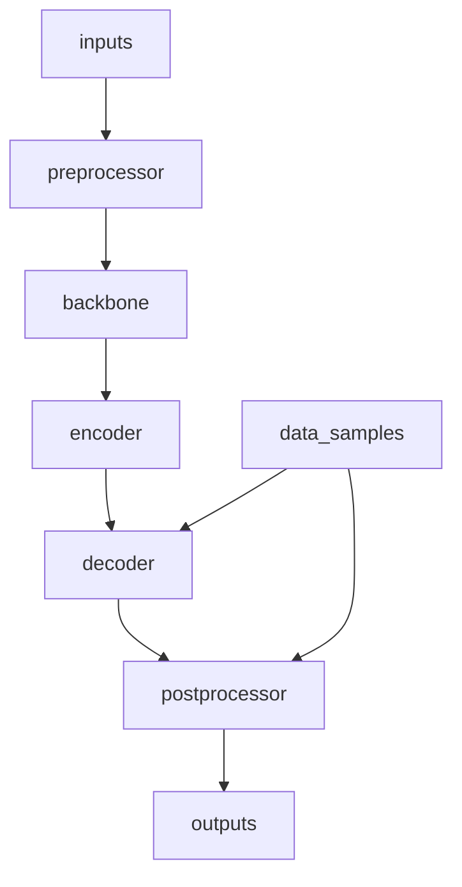

# Recognizer

## 6. TableMaster

**Chức năng:** Main recognizer class cho table structure recognition. Tích hợp tất cả components (backbone, encoder, decoder) thành một model hoàn chỉnh với dual-head architecture.

**Đặc điểm:**
- Tích hợp backbone, encoder, decoder thành end-to-end model
- Dual-head architecture cho structure recognition và bbox regression
- Hỗ trợ cả training và inference modes
- Flexible component configuration
- Tương thích với mmOCR framework

**Input:**
- `inputs`: Batch tensor ảnh (torch.Tensor, shape: [N, C, H, W])
- `data_samples`: Batch TableMasterDataSample với ground truth

**Output:**
- **Training:** Dictionary với loss values
- **Inference:** List TableMasterDataSample với predictions

**Tham số cấu hình:**
- `preprocessor`: Preprocessing module (optional)
- `backbone`: Backbone configuration
- `encoder`: Encoder configuration (optional)
- `decoder`: Decoder configuration
- `bbox_loss`: Additional bbox loss configuration (optional)
- `data_preprocessor`: Data preprocessing config
- `init_cfg`: Initialization configuration

**Kiến trúc tổng thể:**


**Quy trình xử lý:**

1. **Feature Extraction:**
   - Preprocessor (optional): TPS hoặc image preprocessing
   - Backbone: Extract spatial features
   - Encoder: Add positional encoding và sequence formatting

2. **Decoding:**
   - Decoder: Dual-head prediction (tokens + bboxes)
   - Loss calculation (training) hoặc postprocessing (inference)

3. **Output Generation:**
   - Training: Return loss dictionary
   - Inference: Return predicted TableMasterDataSample

**Ví dụ cấu hình:**
```python
model = dict(
    type='TableMaster',
    backbone=dict(
        type='TableResNetExtra',
        input_dim=3,
        gcb_config=dict(
            ratio=0.0625,
            headers=1,
            att_scale=False,
            fusion_type="channel_add",
            layers=[False, True, True, True],
        ),
        layers=[1, 2, 5, 3]
    ),
    encoder=dict(
        type='PositionalEncoding',
        d_model=512,
        dropout=0.2,
        max_len=5000
    ),
    decoder=dict(
        type='TableMasterConcatDecoder',
        n_layers=3,
        n_head=8,
        d_model=512,
        max_seq_len=600,
        dictionary=dictionary,
        # ... decoder config
    ),
    data_preprocessor=dict(
        type='TextRecogDataPreprocessor',
        mean=[127.5, 127.5, 127.5],
        std=[127.5, 127.5, 127.5]
    )
)
```

**Training Flow:**
```python
# Forward pass
losses = model.loss(inputs, data_samples)
# losses = {'loss_cls': ..., 'loss_bbox': ...}

# Backward pass
optimizer.zero_grad()
losses['loss'].backward()
optimizer.step()
```

**Inference Flow:**
```python
# Forward pass
predictions = model.predict(inputs, data_samples)
# predictions = [TableMasterDataSample(...), ...]

# Extract results
for pred in predictions:
    tokens = pred.pred_tokens.item
    bboxes = pred.pred_instances.bboxes
    scores = pred.pred_tokens.scores
```

**Quan hệ với pipeline:**
- Nhận inputs từ @import "../datasets/transforms/pack_inputs/README.md"
- Sử dụng @import "backbones/README.md", @import "encoders/README.md", @import "decoders/README.md"
- Outputs có thể được visualize hoặc evaluate

**Lưu ý đặc biệt:**
- Model architecture flexible, có thể skip encoder nếu không cần
- Dual-head design essential cho table structure + bbox prediction
- Data preprocessor phải consistent với training normalization
- Component initialization important cho training stability
